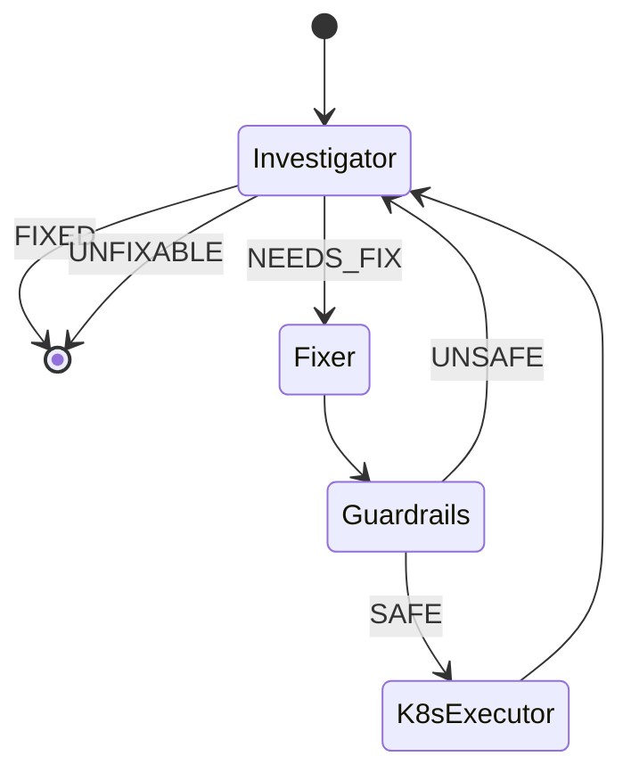

# Service Debugger Workflow

Diagnose and fix broken Kubernetes services using a four-agent loop. Each
agent runs as an ephemeral Ray actor with a dedicated role and toolset.

## State Diagram



## Agents

| Agent | Actor Class | Tools | Role |
|---|---|---|---|
| Investigator | `InvestigatorActor` | Read-only K8s MCP | Gathers pods, logs, events, and resource status. Determines if the issue is fixed or needs intervention. |
| Fixer | `FixerActor` | None | Receives the diagnosis and proposes specific commands to fix the issue. Does not execute anything. |
| Guardrails | `GuardrailsActor` | None | Evaluates proposed commands for safety — checks for cross-service impact, destructive operations, and missing namespace scoping. |
| Executor | `K8sExecutorActor` | Read-write K8s MCP | Executes only the approved commands, then hands back to Investigator for verification. |

## Routing

Conditional edges are driven by text markers in the agent responses:

- **Investigator** ends each response with `STATUS: FIXED`, `STATUS: NEEDS_FIX`, or `STATUS: UNFIXABLE`
- **Guardrails** ends each response with `VERDICT: SAFE` or `VERDICT: UNSAFE`

The routing functions parse the last AI message content for these markers.

## Prerequisites

1. **Read-only K8s MCP server** (already deployed) — provides investigation
   tools (pods_list, pods_log, events_list, resources_get, etc.)

2. **Read-write K8s MCP server** — deploy via the ArgoCD application at
   `apps/kubernetes-mcp-server-rw.yaml`. Uses the `edit` ClusterRole.
   Internal only (no ingress).

3. An **LLM provider** with a model that supports tool calling
   (e.g. Ollama with nemotron, or OpenAI with gpt-4.1).

## Usage

```bash
# Debug a specific service
uv run cli.py query -w service-debugger "Debug the ollama service in the ollama namespace"

# With a persistent thread to continue investigation
uv run cli.py query -w service-debugger -t debug-ollama "Check if ollama is healthy now"
```

### Example Output

```
thread: abc123
[investigator] Checking pods in namespace ollama...
[investigator] calling pods_list({'labelSelector': 'app=ollama'})
[investigator] Found CrashLoopBackOff on pod ollama-xyz. OOMKilled detected.
               STATUS: NEEDS_FIX
[fixer] Proposed fix:
        $ kubectl patch deployment ollama -n ollama -p '{"spec":{"template":{"spec":{"containers":[{"name":"ollama","resources":{"limits":{"memory":"8Gi"}}}]}}}}'
[guardrails] Command is scoped to the ollama deployment in the ollama namespace.
             No cross-service impact detected. VERDICT: SAFE
[k8s_executor] calling resources_get({'apiVersion': 'apps/v1', 'kind': 'Deployment', ...})
[k8s_executor] Patched deployment ollama with increased memory limit.
[investigator] Pod ollama-abc now Running with 0 restarts. STATUS: FIXED
```

## Configuration

Environment variables (set in the RayService manifest):

| Variable | Default | Purpose |
|---|---|---|
| `K8S_MCP_RO_URL` | `http://kubernetes-mcp-server.kubernetes-mcp.svc.cluster.local:8080/mcp` | Read-only MCP server endpoint |
| `K8S_MCP_RW_URL` | `http://kubernetes-mcp-server-rw.kubernetes-mcp.svc.cluster.local:8080/mcp` | Read-write MCP server endpoint |

## Extending

### Add investigation capabilities

The Investigator uses whatever tools the read-only MCP server provides. To
add new investigation tools, extend the MCP server or add a second MCP
server and merge the tool lists.

### Add guardrail checks

Edit the `GUARDRAILS_PROMPT` in `__init__.py` to add new safety rules. The
Guardrails agent is prompt-driven — no code changes needed for new policies.

### Change the fix-verify loop limit

Set `MAX_ITERATIONS` in `__init__.py`. The `recursion_limit` in the graph
config is set to `MAX_ITERATIONS * 10` to account for internal tool-calling
loops within each iteration.
